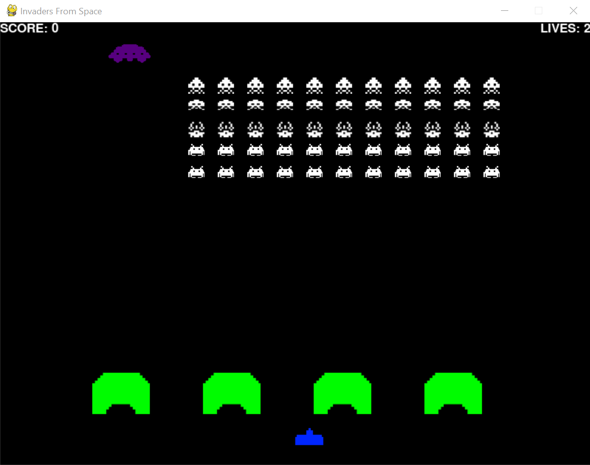

# Invaders From Space

A simple version of the classic Space Invaders games implemented in Python 3.5

### How to Run
0. ensure that python 3.5 and pygame are installed
1. run space_invaders.py

### Controls
- move the turret using the left and right arrow keys
- fire the turret's weapon using the Enter key

